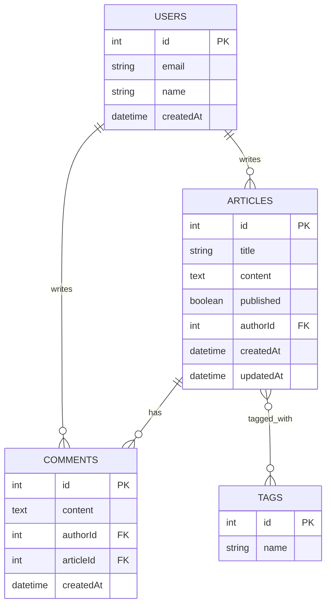

# ER図 (User / Article / Comment / Tag)

```mermaid
erDiagram
  USERS ||--o{ ARTICLES : writes
  USERS ||--o{ COMMENTS : writes
  ARTICLES ||--o{ COMMENTS : has
  ARTICLES }o--o{ TAGS : tagged_with

  USERS {
    int id PK
    string email
    string name
    datetime createdAt
  }
  ARTICLES {
    int id PK
    string title
    text content
    boolean published
    int authorId FK
    datetime createdAt
    datetime updatedAt
  }
  COMMENTS {
    int id PK
    text content
    int authorId FK
    int articleId FK
    datetime createdAt
  }
  TAGS {
    int id PK
    string name
  }
```

- `ARTICLES` ⇔ `TAGS` は多対多(中間テーブル `article_tags` を自動生成)
- 現時点では認証未実装のため、作成系APIは `authorId` をリクエストボディで直接指定する
